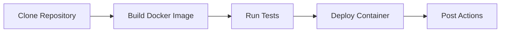

## Pipeline Architecture

This Jenkins CI/CD pipeline automates the entire software delivery process from code checkout to production deployment. The pipeline is designed for a Node.js application and uses Docker for containerization.

## Workflow Diagram

The pipeline executes the following sequential workflow:

## Pipeline Components

### Agent Configuration

The pipeline uses `agent any`, allowing Jenkins to run the pipeline on any available agent.

### Environment Variables

<ParamField path="IMAGE_NAME" type="string" default="nodejs-demo-app">
  The Docker image name used throughout the pipeline stages
</ParamField>

## Pipeline Stages

The pipeline consists of four main stages:

<CardGroup cols={2}>
  <Card title="Clone" icon="code-branch">
    Clones the source code from the GitHub repository
  </Card>
  <Card title="Build" icon="docker">
    Builds a Docker image from the application source code
  </Card>
  <Card title="Test" icon="vial">
    Installs dependencies and runs the test suite
  </Card>
  <Card title="Deploy" icon="rocket">
    Deploys the containerized application on port 80
  </Card>
</CardGroup>

## Post-Build Actions

The pipeline includes three post-build hooks:

- **always**: Executes regardless of pipeline outcome
- **success**: Executes only when all stages succeed
- **failure**: Executes when any stage fails

These hooks provide visibility into pipeline execution status and enable custom notifications or cleanup actions.

## Application Details

<Info>
The pipeline deploys a Node.js Express application that:
- Runs on **port 3000** internally
- Maps to **port 80** externally
- Serves a simple "Hello" message at the root endpoint
</Info>

## Quick Start

To run this pipeline:

1. Ensure Docker is installed on the Jenkins agent
2. Configure Jenkins with necessary permissions
3. Create a new Pipeline job in Jenkins
4. Point to the Jenkinsfile in your repository
5. Trigger the build

## Next Steps

<CardGroup cols={2}>
  <Card title="Jenkinsfile Reference" icon="file-code" href="/pipeline/jenkinsfile">
    View the complete Jenkinsfile with detailed annotations
  </Card>
  <Card title="Stage Documentation" icon="layer-group" href="/pipeline/stages">
    Deep dive into each pipeline stage
  </Card>
  <Card title="Deployment Process" icon="ship" href="/pipeline/deployment">
    Learn about Docker deployment and port mapping
  </Card>
</CardGroup>