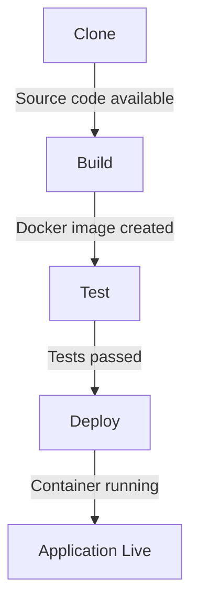

## Stage Overview

The Jenkins pipeline consists of four sequential stages that automate the software delivery process:

<Steps>
  <Step title="Clone">
    Check out source code from GitHub repository
  </Step>
  <Step title="Build">
    Build Docker image from application source
  </Step>
  <Step title="Test">
    Install dependencies and run test suite
  </Step>
  <Step title="Deploy">
    Deploy containerized application to production
  </Step>
</Steps>

## Stage Details

<Tabs>
  <Tab title="Clone">
    ## Clone Stage

    The Clone stage checks out the source code from the GitHub repository.

    ### Implementation

    ```groovy
    stage('Clone') {
        steps {
            echo 'Cloning the repository...'
            git branch: 'main', url: 'https://github.com/mani-6666/Jenkins-Pipeline-for-CI-CD.git'
        }
    }
    ```

    ### Configuration

    <ParamField path="branch" type="string" default="main">
      The Git branch to clone. This pipeline uses the `main` branch.
    </ParamField>

    <ParamField path="url" type="string" required>
      The GitHub repository URL to clone from.
    </ParamField>

    ### Process Flow

    1. Jenkins echoes a status message
    2. Git clone command executes
    3. Repository contents are checked out to Jenkins workspace
    4. Subsequent stages have access to the source code

    ### Common Issues

    <Warning>
    **Private Repository Access**: If cloning a private repository, you must configure credentials:

    ```groovy
    git branch: 'main', 
        url: 'https://github.com/org/repo.git',
        credentialsId: 'github-credentials-id'
    ```
    </Warning>

    <Tip>
    For better performance with large repositories, use shallow clones:

    ```groovy
    checkout([
        $class: 'GitSCM',
        branches: [[name: '*/main']],
        extensions: [[$class: 'CloneOption', depth: 1, noTags: false, shallow: true]],
        userRemoteConfigs: [[url: 'https://github.com/your/repo.git']]
    ])
    ```
    </Tip>
  </Tab>

  <Tab title="Build">
    ## Build Stage

    The Build stage creates a Docker image from the application source code using the Dockerfile.

    ### Implementation

    ```groovy
    stage('Build') {
        steps {
            echo 'Building Docker image...'
            sh 'docker build -t $IMAGE_NAME:latest .'
            echo 'Docker image built successfully!'
        }
    }
    ```

    ### Docker Build Command

    ```bash
    docker build -t $IMAGE_NAME:latest .
    ```

    <ParamField path="-t" type="string">
      Tag the image as `nodejs-demo-app:latest`
    </ParamField>

    <ParamField path="." type="path">
      Build context (current directory containing Dockerfile)
    </ParamField>

    ### Dockerfile Used

    The build stage uses this Dockerfile from the repository:

    ```dockerfile
    FROM node:18-alpine

    # Set working directory
    WORKDIR /app

    # Copy files
    COPY package*.json ./
    RUN npm install
    COPY . .

    # Expose port
    EXPOSE 3000

    # Run app
    CMD ["node", "index.js"]
    ```

    ### Build Process

    1. **Base Image**: Pulls `node:18-alpine` (lightweight Node.js image)
    2. **Working Directory**: Sets `/app` as the working directory
    3. **Dependencies**: Copies package.json and runs `npm install`
    4. **Application Code**: Copies all source files
    5. **Port Configuration**: Exposes port 3000
    6. **Startup Command**: Defines `node index.js` as the entry point

    ### Prerequisites

    <Warning>
    **Docker Installation Required**

    The Jenkins agent must have:
    - Docker installed and running
    - Jenkins user added to the docker group
    - Sufficient disk space for image layers
    </Warning>

    ### Best Practices

    <Tip>
    **Multi-stage Builds**: For production, consider using multi-stage builds to reduce image size:

    ```dockerfile
    FROM node:18-alpine AS builder
    WORKDIR /app
    COPY package*.json ./
    RUN npm ci --only=production

    FROM node:18-alpine
    WORKDIR /app
    COPY --from=builder /app/node_modules ./node_modules
    COPY . .
    EXPOSE 3000
    CMD ["node", "index.js"]
    ```
    </Tip>
  </Tab>

  <Tab title="Test">
    ## Test Stage

    The Test stage installs Node.js dependencies and executes the test suite.

    ### Implementation

    ```groovy
    stage('Test') {
        steps {
            echo 'Running tests...'
            sh 'npm install'
            sh 'npm test || echo "No tests defined or test failed, continuing..."'
        }
    }
    ```

    ### Commands Executed

    <CodeGroup>
    ```bash npm install
    npm install
    ```

    ```bash npm test
    npm test || echo "No tests defined or test failed, continuing..."
    ```
    </CodeGroup>

    ### Process Flow

    <Steps>
      <Step title="Install Dependencies">
        Runs `npm install` to install all packages from package.json
      </Step>
      <Step title="Execute Tests">
        Runs `npm test` to execute the test suite defined in package.json
      </Step>
      <Step title="Handle Failures">
        If tests fail or are undefined, logs a message but continues pipeline execution
      </Step>
    </Steps>

    ### Test Execution Behavior

    <Info>
    The `|| echo "..."` fallback ensures the pipeline continues even if:
    - No tests are defined in package.json
    - Tests fail during execution

    This is useful for development but should be reconsidered for production pipelines.
    </Info>

    ### Production Configuration

    For production environments, enforce test success:

    ```groovy
    stage('Test') {
        steps {
            echo 'Running tests...'
            sh 'npm install'
            sh 'npm test'  // Fails pipeline if tests fail
        }
    }
    ```

    ### Advanced Testing Options

    <Tabs>
      <Tab title="Code Coverage">
        ```groovy
        stage('Test') {
            steps {
                sh 'npm install'
                sh 'npm run test:coverage'
                publishHTML([
                    reportDir: 'coverage',
                    reportFiles: 'index.html',
                    reportName: 'Coverage Report'
                ])
            }
        }
        ```
      </Tab>

      <Tab title="Parallel Tests">
        ```groovy
        stage('Test') {
            parallel {
                stage('Unit Tests') {
                    steps {
                        sh 'npm run test:unit'
                    }
                }
                stage('Integration Tests') {
                    steps {
                        sh 'npm run test:integration'
                    }
                }
            }
        }
        ```
      </Tab>

      <Tab title="Test Artifacts">
        ```groovy
        stage('Test') {
            steps {
                sh 'npm install'
                sh 'npm test'
            }
            post {
                always {
                    junit 'test-results/**/*.xml'
                }
            }
        }
        ```
      </Tab>
    </Tabs>

    ### Common Issues

    <Warning>
    **Dependency Installation Failures**

    If `npm install` fails, check:
    - Node.js version compatibility
    - Network access to npm registry
    - Proper package.json syntax
    - File permissions in workspace
    </Warning>
  </Tab>

  <Tab title="Deploy">
    ## Deploy Stage

    The Deploy stage runs the Docker container and exposes the application on port 80.

    ### Implementation

    ```groovy
    stage('Deploy') {
        steps {
            echo 'Deploying Docker container...'
            sh 'docker run --name Jenkins -d -p 80:3000 $IMAGE_NAME:latest'
            echo 'App deployed on port 80!'
        }
    }
    ```

    ### Docker Run Command

    ```bash
    docker run --name Jenkins -d -p 80:3000 nodejs-demo-app:latest
    ```

    ### Command Parameters

    <ParamField path="--name" type="string" default="Jenkins">
      Assigns the container name as "Jenkins" for easy identification
    </ParamField>

    <ParamField path="-d" type="flag">
      Runs the container in detached mode (background process)
    </ParamField>

    <ParamField path="-p" type="string" default="80:3000">
      Maps host port 80 to container port 3000
    </ParamField>

    <ParamField path="IMAGE_NAME" type="string" default="nodejs-demo-app:latest">
      The Docker image to run (built in the Build stage)
    </ParamField>

    ### Port Mapping

    ```
    Host Port 80 → Container Port 3000
    ```

    - **Container Port 3000**: The Node.js application listens on this port internally
    - **Host Port 80**: External users access the application via this port

    <Info>
    Users can access the deployed application at:
    - `http://your-server-ip:80`
    - `http://your-server-ip` (port 80 is default for HTTP)
    </Info>

    ### Deployment Verification

    After deployment, verify the container is running:

    ```bash
    # Check container status
    docker ps | grep Jenkins

    # View container logs
    docker logs Jenkins

    # Test the application
    curl http://localhost:80
    ```

    ### Common Issues

    <Warning>
    **Port Already in Use**

    If port 80 is already in use:
    ```bash
    # Check what's using port 80
    sudo lsof -i :80

    # Use a different port
    docker run --name Jenkins -d -p 8080:3000 $IMAGE_NAME:latest
    ```
    </Warning>

    <Warning>
    **Container Name Conflict**

    If a container named "Jenkins" already exists:
    ```bash
    # Remove existing container
    docker rm -f Jenkins

    # Or use a different name
    docker run --name Jenkins-v2 -d -p 80:3000 $IMAGE_NAME:latest
    ```
    </Warning>

    ### Production Deployment Options

    <Tabs>
      <Tab title="Health Checks">
        ```groovy
        sh '''docker run --name Jenkins -d \
          -p 80:3000 \
          --health-cmd="curl -f http://localhost:3000 || exit 1" \
          --health-interval=30s \
          --health-timeout=10s \
          --health-retries=3 \
          $IMAGE_NAME:latest'''
        ```
      </Tab>

      <Tab title="Resource Limits">
        ```groovy
        sh '''docker run --name Jenkins -d \
          -p 80:3000 \
          --memory="512m" \
          --cpus="1.0" \
          $IMAGE_NAME:latest'''
        ```
      </Tab>

      <Tab title="Auto-Restart">
        ```groovy
        sh '''docker run --name Jenkins -d \
          -p 80:3000 \
          --restart=unless-stopped \
          $IMAGE_NAME:latest'''
        ```
      </Tab>

      <Tab title="Environment Variables">
        ```groovy
        sh '''docker run --name Jenkins -d \
          -p 80:3000 \
          -e NODE_ENV=production \
          -e PORT=3000 \
          $IMAGE_NAME:latest'''
        ```
      </Tab>
    </Tabs>
  </Tab>
</Tabs>

## Stage Dependencies

Each stage depends on the successful completion of previous stages:



## Related Documentation

<CardGroup cols={2}>
  <Card title="Complete Jenkinsfile" icon="file-code" href="/pipeline/jenkinsfile">
    View the full Jenkinsfile with all stages
  </Card>
  <Card title="Deployment Details" icon="rocket" href="/pipeline/deployment">
    Deep dive into Docker deployment process
  </Card>
</CardGroup>